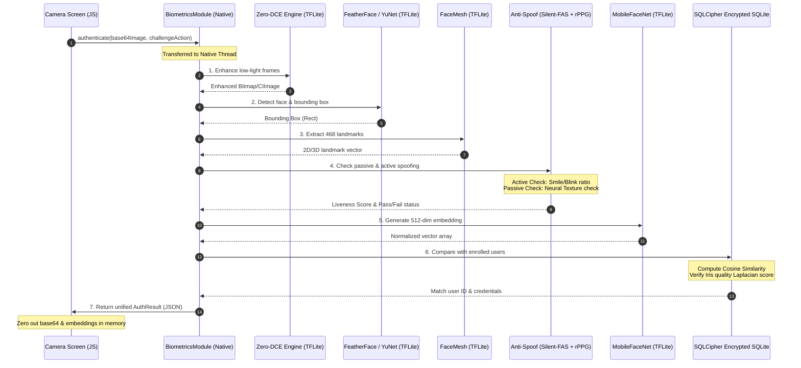
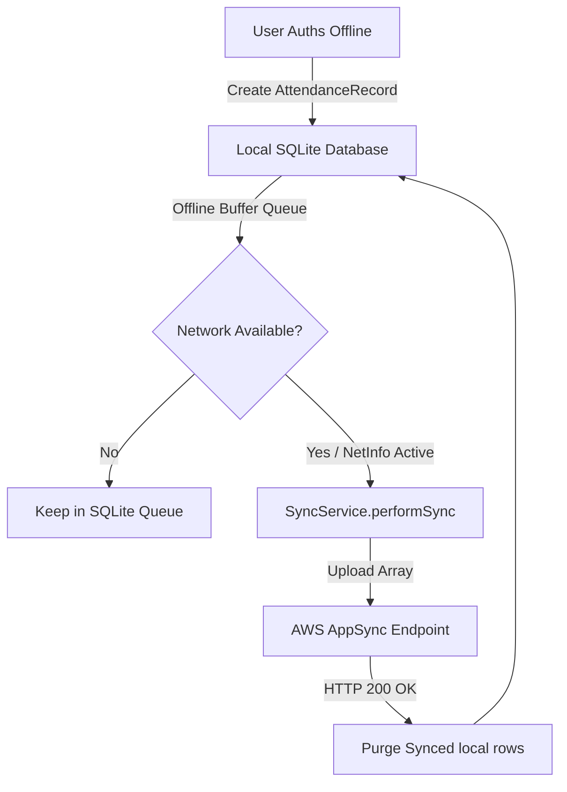

# System Architecture Specification — NHAI Biometrics

This document details the software architecture, pipeline sequence, and data flow of the offline-first facial recognition and liveness detection system designed for NHAI Datalake 3.0.

---

## 🏗️ Asynchronous Processing Model

The biometric pipeline operates with strict decoupling between the **JavaScript UI Thread** and **Background Native Worker Threads** to ensure zero frame drop on camera renderings (60fps).

*   **Android**: Kotlin Coroutines dispatching tasks to `Dispatchers.Default` (heavy CPU matching) and `Dispatchers.IO` (SQLite reads).
*   **iOS**: Grand Central Dispatch (GCD) managing high-priority serial queues (`com.nhai.biometrics.pipeline`).

---

## 🔄 7-Step Security Pipeline

When the user takes a snapshot during an active challenge (e.g. `smile` or `blink`), the captured frame is passed through the 7-step security pipeline.



---

## 💾 Offline Sync Architecture

The sync subsystem runs an **offline-first local queue**. SQLite acts as the durable database cache.



---

## 🗃️ Encrypted Local Database Schema

The database table `attendance_records` holds buffered entries:
```sql
CREATE TABLE IF NOT EXISTS attendance_records (
    id TEXT PRIMARY KEY,
    userId TEXT NOT NULL,         -- SHA-256 Hashed Identifier
    username TEXT NOT NULL,       -- Display name
    timestamp INTEGER NOT NULL,   -- UNIX Epoch MS
    synced INTEGER DEFAULT 0      -- Boolean Flag
);
```

The database table `enrolled_users` stores identity vectors:
```sql
CREATE TABLE IF NOT EXISTS enrolled_users (
    userId TEXT PRIMARY KEY,      -- SHA-256 Hashed Identifier
    username TEXT NOT NULL,
    embedding BLOB NOT NULL,      -- Encrypted AES-256 512-float vector
    additionalData TEXT
);
```
All columns containing PII or biometric vectors are encrypted using standard SQLCipher database keys derived through high-iteration PBKDF2.
